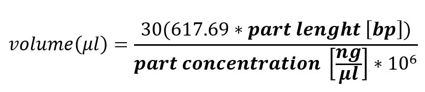

# MetCloOT2 : Automated MetClo assembly on Opentron OT2 liquid handeling robot

The University of Edinburgh - MSc Synthetic Biology and Biotechnology Dissertation

by Daniella Matute 

## About MetCloOT2

Welcome to MetCloOT2. This program is designed to accept information about metclo based assemblies and design a custom Opentron protocol capable of being run on OpenTrons' OT2 liquid handeling machine. The program is based on [Lin & O’Callaghan (2018)](https://doi.org/10.1093/nar/gky596) and [Lin & O'Callaghan(2020)](http://link.springer.com/10.1007/978-1-0716-0908-8_9).

## How too.
1. Prior to using  MetCloOT2, assure the quality of the assembly and simulate the assembly using computational tools, such as those found in the [EGF's Cuba suite](https://cuba.genomefoundry.org/home).
2. Create 2 input .csv files, one containing informations of the assemblies and the other infomration about the parts. *Under /example, 2 files are provided depicting the layout of the .csv files.* The assembly file, will look very similar to the assembly plan used in [Simulate Golden Gate Assemblies](https://cuba.genomefoundry.org/simulate_gg_assemblies) with the exception that a assembly size columb in added. 
3. Assure that 30fmol of all parts is equal to atleast 1ul. Use the new concentration in the part.csv file. 
Use the following formula:
 
Or copy this formula into excel:

*=round((18530.7 * [part lenght (bp)]  + 1081.2) / ( [part concentration (ng/ul)] * 10^6) ,3)*

4. Clone this MetcloOT2 repository from GitHub.
5. Run the **metclo_plan.py** file and follow the instructions that appear in the terminal. 
6. The the protocol will generate 4 files:
- metclo_plan.pdf
- assembly_data.csv
- part_data.csv
- position_data.csv
7. Read and follow the instruction of the **metclo_plan.pdf**. 
8. Run **ot2metclo.py** on the Opentrons App. For assistance refer to [OT - 2 : Getting Started]( https://support.opentrons.com/s/ot2-get-started).
